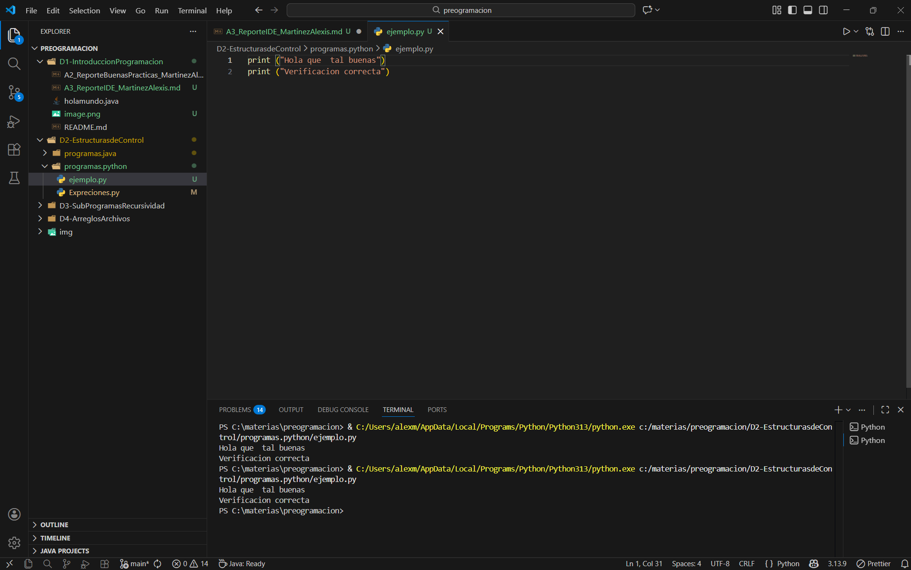

# Actividad 3 — Configuración de un Entorno de Desarrollo Integrado (IDE)

**Alumno:** Martinez Mendoza Alexis Daniel  
**Grupo:** 2DSM-G3  
**Fecha:** 15/01/2026  
**Unidad:** INTRODUCCIÓN A PROGRAMACIÓN

## 1. IDE seleccionado
- IDE: Visual Studio Code
- Versión: 1.95.x
- Sistema operativo: Windows 11

## 2. Justificación
- Criterio 1: Visual Studio Code permite trabajar con Java, Python, C, C++, JavaScript y otros lenguajes mediante extensiones oficiales, lo que elimina la necesidad de instalar varios entornos.
- Criterio 2: El IDE tiene un rendimiento estable incluso en equipos con hardware limitado, lo cual facilita su uso en equipos escolares o personales.
- Criterio 3: Cuenta con documentación oficial y actualizaciones frecuentes.

## 3. Requisitos previos
- Requisito 1: Sistema operativo Windows 11.
- Requisito 2: Instalación del JDK (Java Development Kit) o del lenguaje requerido.
- Permisos: Acceso como administrador para instalar y modificar configuraciones del sistema.

## 4. Instalación (paso a paso)

1. - Acceder al sitio oficial: https://git-scm.com/ descargarlo y ya tener descargado VSCode

- Seleccionar el instalador compatible con Windows 64 bits.

2. - Ejecutar Git-x.x.x-64-bit.exe.

- Aceptar la licencia.

- Mantener los valores predeterminados en:

-Editor por defecto.

-Configuración de PATH (Git from the command line).

-Backend de transporte HTTPS.

- Completar la instalación con Install.

3. - Definir identidad del usuario
```
git config --global user.name "Nombre apellido"
git config --global user.email "josemanuel@gamail.com"
```
4. - Abrir el proyecto en VS Code

-Crear una carpeta de trabajo

-Abrir VS Code.

-Seleccionar File > Open Folder y elegir la carpeta creada.

5. - Inicializar Git desde VS Code
```
git init
```
Esto genera la carpeta .git en el proyecto.

6. - Agregar Archivos al Stage

```
git add .
```
7. - Creación del Primer Commit
```
git commit -m "Primer commit del proyecto"
```
8. - Creación del Repositorio en GitHub

- Iniciar sesión en https://github.com

- Seleccionar New Repository.

- Ingresar el nombre del proyecto.

- Seleccionar visibilidad (público o privado).

- No agregar README ni .gitignore (ya existen localmente).

- Crear el repositorio.

GitHub mostrará la URL remota, por ejemplo:
````
https://github.com/usuario/proyecto-git.git
````
9. - Vinculación del Repositorio Local con GitHub
````
git remote add origin https://github.com/usuario/proyecto-git.git
````
10. - Subir el Proyecto a GitHub

Configurar la rama principal
```
git branch -M main
```
Enviar los cambios por primera vez
```
git push -u origin main
```
Tras esto, el repositorio estará sincronizado con GitHub.
### 4.1 Verificación
- ¿Cómo comprobé que funciona?

Creando un archivo de prueba (prueba.py).
- Evidencia (captura):


## 5. Configuración inicial
### 5.1 Ajustes básicos
- Configuración del idioma español.

- Activación de guardado automático (Auto Save).

- Selección de tema oscuro predeterminado.

- Ajuste de tamaño de fuente a 14 puntos.
 

### 5.2 Extensiones / plugins

| Extensión/Plugin | Función | Por qué |
|---|---|---|
| Java Extension Pack|Autocompletado, ejecución y depuración de Java |Permite programar y verificar código Java sin configuraciones externas |
 Code Runner|Ejecución rápida de código|Facilita pruebas inmediatas durante el aprendizaje|
Prettier|Formateo automático|Mantiene una estructura uniforme del código|
Spanish Language Pack|Traducción de la interfaz|Mejora la comprensión de las opciones del IDE|

### 5.3 Herramientas adicionales (si aplica)
- Compilador/intérprete: JDK 21
- Prueba: Ejecución de un programa básico de Java mediante la función Run del IDE.

## 6. Prueba final (mini-ejercicio)
```java
public class InfoAntonelli {
    public static void main(String[] args) {
        String piloto = "Kimi Antonelli";
        String categoria = "Fórmula 2"; 
        String academia = "Mercedes Junior Team";
        int edad = 18;
        double mejorTiempo = 1.31; // tiempo aproximado en minutos para una vuelta rápida
        
        System.out.println("Piloto: " + piloto);
        System.out.println("Categoría: " + categoria);
        System.out.println("Academia: " + academia);
        System.out.println("Edad: " + edad + " años");
        System.out.println("Mejor tiempo de vuelta registrado: " + mejorTiempo + " minutos");
    }
}
```
## 7. Conclusiones

- La configuración del entorno Visual Studio Code se completó sin incidencias. El IDE proporciona soporte para múltiples lenguajes, consume pocos recursos y permite una configuración flexible mediante extensiones. Esto garantiza un entorno estable y adecuado para actividades de aprendizaje y desarrollo inicial en programación.


